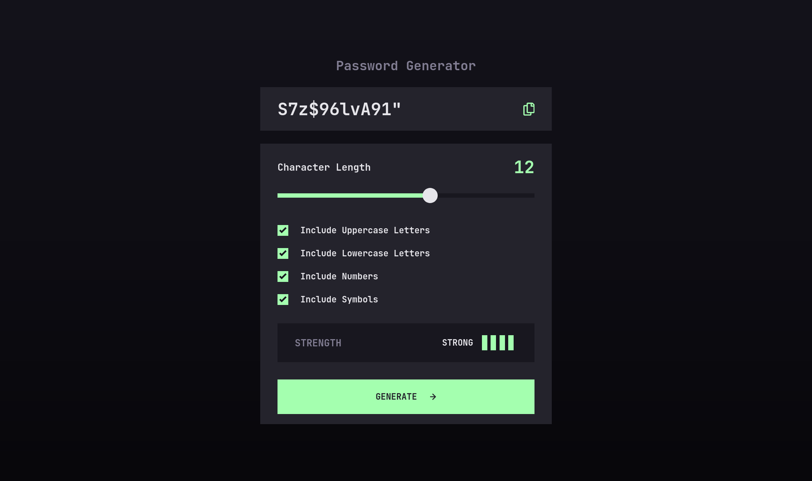

# Frontend Mentor - Password generator app solution

This is a solution to the [Password generator app challenge on Frontend Mentor](https://www.frontendmentor.io/challenges/password-generator-app-Mr8CLycqjh). Frontend Mentor challenges help you improve your coding skills by building realistic projects.

## Table of contents

- [Overview](#overview)
  - [The challenge](#the-challenge)
  - [Screenshot](#screenshot)
  - [Links](#links)
- [My process](#my-process)
  - [Built with](#built-with)
  - [What I learned](#what-i-learned)
  - [Continued development](#continued-development)
  - [Useful resources](#useful-resources)
- [Author](#author)


## Overview

### The challenge

Users should be able to:

- Generate a password based on the selected inclusion options
- Copy the generated password to the computer's clipboard
- See a strength rating for their generated password
- View the optimal layout for the interface depending on their device's screen size
- See hover and focus states for all interactive elements on the page

### Screenshot



### Links

<!-- - Solution URL: [Add solution URL here](https://your-solution-url.com) -->

- Live Site URL: [Github Pages](https://mehdi-zibout.github.io/FEM-password-generator-app/)

## My process

### Built with

- [React](https://reactjs.org/) - JS library
- [Vite](https://vitejs.dev/)
- [Tailwindcss](https://tailwindcss.com/) - For styles
- [Styled Components](https://styled-components.com/) - I used it particulary to style the input rage
- Flexbox

### What I learned

I keep hearing about why `Create React App` is bad a no one should be using it, I looked for alternatives and I opted for `Vite` for this challenge.
Most of the difficulties I faced stemmed from styling the `html inputs`, I found a simple way to style the `input range` but for the `checkbox` I ended up creating a component for it.
I also learnt how to implement `copy to the clipboard feature` and I found that it's just a simpl one line of code

```tsx
navigator.clipboard.writeText('the thing to be copied').then(() => {
  // what to do after
});
```

Finally thinking about how to generate the password, I learnt about a `String` method `fromCharCode` that takes a decimal and returns the unicode character associated with it. So I used it along `Math.random()` to generate the passwords

```tsx
function getUpper(): string {
  return String.fromCharCode(Math.floor(Math.random() * 26 + 65));
}

function getLower(): string {
  return String.fromCharCode(Math.floor(Math.random() * 26 + 97));
}

function getNumber(): string {
  return Math.floor(Math.random() * 10).toString();
}

function getSymbol(): string {
  const randomSymbs = [
    String.fromCharCode(Math.floor(Math.random() * 15 + 33)),
    String.fromCharCode(Math.floor(Math.random() * 7 + 58)),
    String.fromCharCode(Math.floor(Math.random() * 6 + 91)),
    String.fromCharCode(Math.floor(Math.random() * 4 + 123)),
  ];
  return randomSymbs[Math.floor(Math.random() * 4)][0];
}

export default function generatePassword(
  length: number,
  {
    upperCase,
    lowerCase,
    numbers,
    symbols,
  }: {
    upperCase: boolean;
    lowerCase: boolean;
    numbers: boolean;
    symbols: boolean;
  }
): string {
  let password: string[] = [];
  // getting at least one upper one lower one number one symbol if requested
  if (upperCase && password.length < length) password.push(getUpper());
  if (lowerCase && password.length < length) password.push(getLower());
  if (numbers && password.length < length) password.push(getNumber());
  if (symbols && password.length < length) password.push(getSymbol());
  // filling the rest
  while (password.length < length) {
    let x = Math.random();
    if (x < 0.35) {
      if (lowerCase && password.length < length) password.push(getLower());
    } else if (x < 0.65) {
      if (upperCase && password.length < length) password.push(getUpper());
    } else if (x < 0.85) {
      if (numbers && password.length < length) password.push(getNumber());
    } else if (symbols && password.length < length) {
      password.push(getSymbol());
    }
  }
  // rearreanging the password
  let passwordTheWord = '';
  while (password.length > 0) {
    const random = Math.floor(Math.random() * password.length);
    passwordTheWord = passwordTheWord.concat(password[random]);
    password.splice(random, 1);
  }
  return passwordTheWord;
}
```

### Continued development

I think I'm quite familiar with using `tailwindcss`, and it's becoming kinda of second nature to me. But I still waste a lot of time copying a color/size and using it with tailwind. I think I need to learn how to customize the config and hardcord the color/sizes from the start and then when I want to use them I'll just have to use `text-primary` instead of `text-[#14131B]`

### Useful resources

- [Styling the input range](https://www.youtube.com/watch?v=99rxURmD59E) - Starting this project, I had no idea how to style the `input rage`, and google didn't help with that as well, most of the solutions were huge wall of css with bunch of unknown properties to me. thankfuly I found this video which used `styled components` to simplify the process

## Author

- Website - [Mehdi Zibout](https://www.zryqv.com)
- Frontend Mentor - [@mehdizibout](https://www.frontendmentor.io/profile/yourusername)
